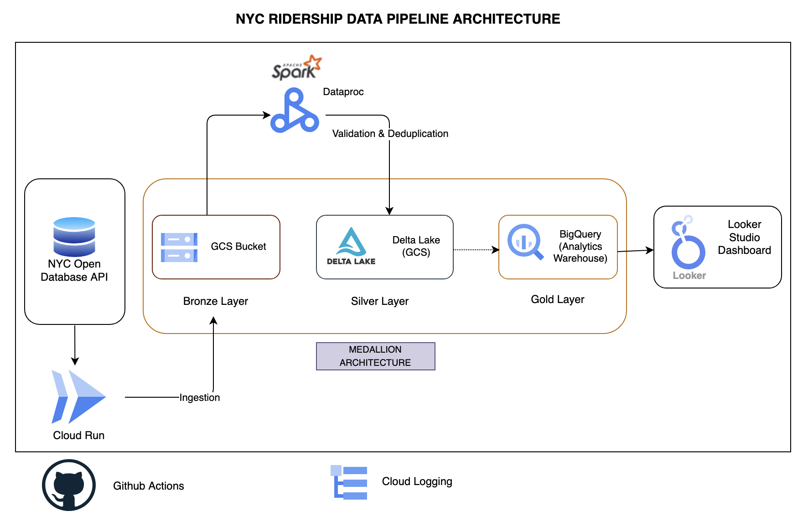

# NYC Subway Ridership ELT Pipeline

## Overview
This project implements an **end-to-end, cloud-native ELT pipeline** for analyzing **NYC Subway ridership data**. It is **idempotent** (safe to re-run without duplicates), **scalable** (handles larger time ranges and higher throughput with horizontal/vertical scaling), and **modular** (clear Bronze → Silver → Gold layers with reusable components). It’s also **fault-tolerant**, **observable** (logging/metrics), **reproducible** (config-driven) pipeline.

## Architecture

## Features & Key Highlights

- **Automated Ingestion** → Fetches NYC Subway ridership data directly from the NY Open Data API using Cloud Run.  
- **Cloud-Native Storage** → Stores raw ingested data in Google Cloud Storage (GCS) for reliability and scalability.  
- **Distributed Processing** → Uses Dataproc (Spark + Delta Lake) to clean, transform, and validate large volumes of ridership data.  
- **Analytics Warehouse** → Loads curated datasets into BigQuery for fast, SQL-based analysis.  
- **Interactive Dashboard** → Powers a Looker Studio dashboard to visualize ridership patterns, transfers and other insights.  
- **CI/CD Automation** → Orchestrated with GitHub Actions to enable continuous integration, testing, and deployment across all pipeline components.

## Dashboard

[Looker Studio Dashboard](https://lookerstudio.google.com/reporting/3a7d0955-3d49-4052-bcc3-c1a4aa073990)

